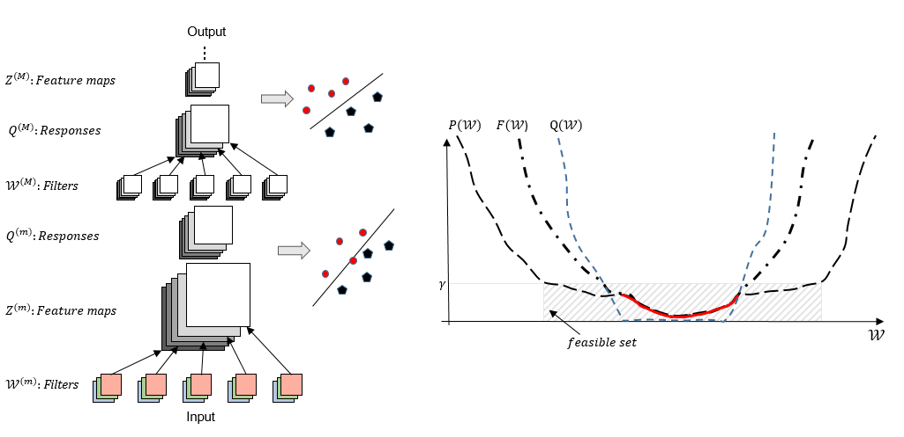

# DSN_TensorFlow

The file DSN_Softmax.py is an implementation of Deep Supervison to the basic LeNet-5-like convolutional neural network found in the file convolutional.py, as taken from the MNIST TensorFlow example. 

The architecture of the Deeply-Supervised Networks and an illustraion of the cost function are shown in the figure below:
